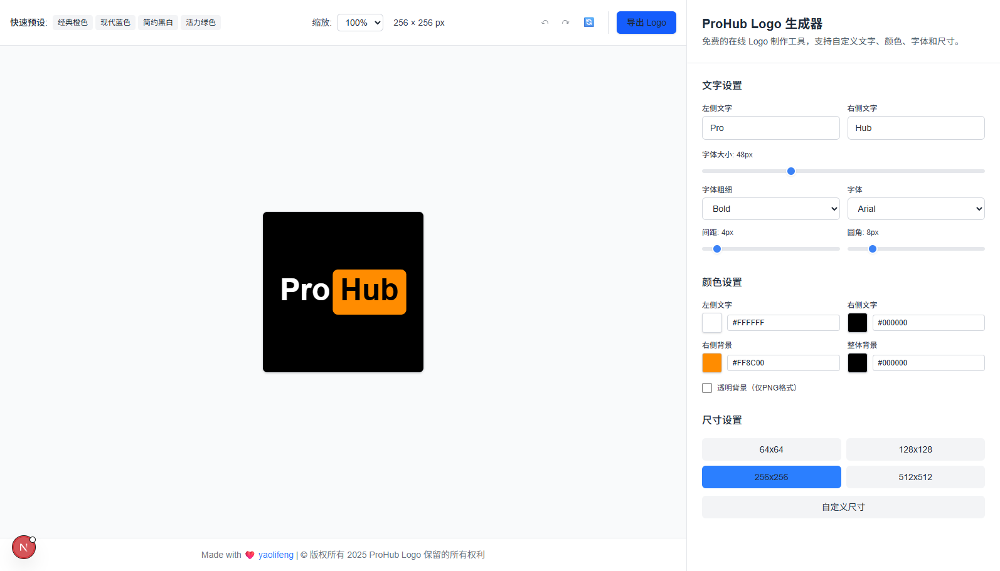
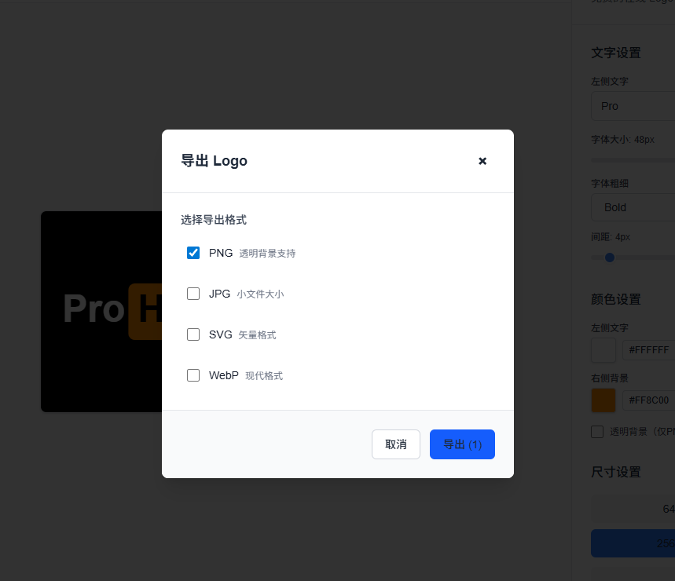

<h1 align="center">ProHub Logo Generator</h1>

  
    

   

🔗 **[Try Now (Global)](https://prohub-logo.vercel.app)** | **[Try Now (China)](https://prohub-logo.netlify.app)**

ProHub Logo Generator is a free, web-based tool for creating professional logos with customizable text, colors, fonts, and styles. Built with Next.js and modern web technologies, it offers real-time preview and multiple export formats without requiring user registration.

## ✨ Features

### 🎨 Text Customization

-   **Custom Text Input**: Personalize left and right text (up to 10 characters each)
-   **Real-time Preview**: See changes instantly as you type
-   **Font Controls**: Adjust size, weight, and font family

### 🎨 Style Controls

-   **Color Customization**:
    -   Left text color
    -   Right text color
    -   Background color
    -   Overall background
-   **Layout Settings**:
    -   Border radius control
    -   Text spacing adjustment
    -   Multiple size presets

### 📤 Export Options

-   **Multiple Formats**: PNG, JPG, SVG, WebP
-   **Quality Control**: Adjustable quality settings
-   **Transparent Background**: PNG format with transparency support
-   **Batch Export**: Export multiple formats at once

### 🔧 User Experience

-   **Responsive Design**: Works on desktop and mobile
-   **Undo/Redo**: Operation history support
-   **Reset Function**: One-click return to defaults
-   **No Registration**: Completely free to use

## 🚀 Live Demo

Visit the links at the top of this README to try the application.

## 📸 Screenshots

### Main Interface

### Export Modal

## 📖 Usage Guide

### Basic Usage

1. **Enter Text**: Type your desired text in the left and right input fields
2. **Customize Style**: Adjust colors, fonts, and layout using the control panel
3. **Preview**: See real-time changes in the preview area
4. **Export**: Click export to download your logo in preferred format

### Advanced Features

-   **Custom Sizes**: Use the size controls to set custom dimensions
-   **Color Picker**: Click on color swatches to open the color picker
-   **Keyboard Shortcuts**: Use Ctrl+Z/Cmd+Z for undo, Ctrl+Y/Cmd+Y for redo

## 🏗️ Technology Stack

-   **Frontend Framework**: [Next.js 15.3.5](https://nextjs.org/)
-   **Language**: [TypeScript](https://www.typescriptlang.org/)
-   **Styling**: [Tailwind CSS](https://tailwindcss.com/)
-   **State Management**: [Zustand](https://zustand-demo.pmnd.rs/)
-   **UI Components**: [Radix UI](https://www.radix-ui.com/)
-   **Build Tool**: [Turbopack](https://turbo.build/pack)
-   **Package Manager**: [pnpm](https://pnpm.io/)

## 📋 Export Formats

| Format   | Use Case   | Features                            |
| -------- | ---------- | ----------------------------------- |
| **PNG**  | Web, Print | Transparency support, High quality  |
| **JPG**  | Web, Email | Smaller file size, No transparency  |
| **SVG**  | Web, Print | Vector format, Scalable, Small size |
| **WebP** | Modern Web | Best compression, Modern browsers   |

## 📄 License

This project is licensed under the MIT License - see the [LICENSE](LICENSE) file for details.

## 👨‍💻 Credits

**Created with ❤️ by**

-   **Developer**: [yaolifeng](https://yaolifeng.com)
-   **Design Inspiration**: Modern logo design principles
-   **Community**: Thanks to all contributors and users

## 🔗 Links

-   **Website**: [yaolifeng.com](https://yaolifeng.com)
-   **GitHub**: [ProHub Logo Generator](https://github.com/yaolifeng0629/prohub-logo)
-   **Issues**: [Report Issues](https://github.com/yaolifeng0629/prohub-logo/issues)
-   **Discussions**: [GitHub Discussions](https://github.com/yaolifeng0629/prohub-logo/discussions)

   

---

  
<strong>Made with ❤️ for the developer community</strong>

  
© 2025 ProHub Logo Generator. All rights reserved.

