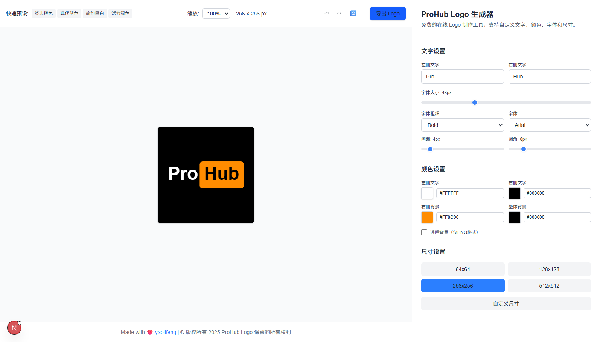

<h1 align="center">ProHub Logo 生成器</h1>

  
   

   

ProHub Logo 生成器是一个免费的在线工具，用于创建专业的 Logo，支持自定义文字、颜色、字体和样式。基于 Next.js 和现代 Web 技术构建，提供实时预览和多种导出格式，无需用户注册。

## ✨ 功能特性

### 🎨 文字自定义

-   **自定义文字输入**: 自定义左右文字（每部分最多 10 个字符）
-   **实时预览**: 输入时立即查看变化
-   **字体控制**: 调整大小、粗细和字体族

### 🎨 样式控制

-   **颜色自定义**:
    -   左侧文字颜色
    -   右侧文字颜色
    -   背景颜色
    -   整体背景
-   **布局设置**:
    -   圆角控制
    -   文字间距调整
    -   多种尺寸预设

### 📤 导出选项

-   **多种格式**: PNG, JPG, SVG, WebP
-   **质量控制**: 可调节质量设置
-   **透明背景**: PNG 格式支持透明背景
-   **批量导出**: 一次导出多种格式

### 🔧 用户体验

-   **响应式设计**: 支持桌面和移动设备
-   **撤销/重做**: 支持操作历史
-   **重置功能**: 一键恢复默认设置
-   **无需注册**: 完全免费使用

## 🚀 在线演示

🔗 **[试用 ProHub Logo 生成器](https://your-deployment-url.vercel.app)**

## 📸 界面截图

### 主界面

### 导出弹窗

## 📖 使用指南

### 基本使用

1. **输入文字**: 在左右输入框中输入所需文字
2. **自定义样式**: 使用控制面板调整颜色、字体和布局
3. **预览**: 在预览区域查看实时变化
4. **导出**: 点击导出以下载首选格式的 Logo

### 高级功能

-   **自定义尺寸**: 使用尺寸控制设置自定义尺寸
-   **颜色选择器**: 点击色块打开颜色选择器
-   **键盘快捷键**: 使用 Ctrl+Z/Cmd+Z 撤销，Ctrl+Y/Cmd+Y 重做

## 🏗️ 技术栈

-   **前端框架**: [Next.js 15.3.5](https://nextjs.org/)
-   **编程语言**: [TypeScript](https://www.typescriptlang.org/)
-   **样式**: [Tailwind CSS](https://tailwindcss.com/)
-   **状态管理**: [Zustand](https://zustand-demo.pmnd.rs/)
-   **UI 组件**: [Radix UI](https://www.radix-ui.com/)
-   **构建工具**: [Turbopack](https://turbo.build/pack)
-   **包管理器**: [pnpm](https://pnpm.io/)

## 👨‍💻 致谢

**由以下人员用 ❤️ 创建**

-   **开发者**: [yaolifeng](https://yaolifeng.com)
-   **设计灵感**: 现代 Logo 设计原则
-   **社区**: 感谢所有贡献者和用户

## 🔗 相关链接

-   **网站**: [yaolifeng.com](https://yaolifeng.com)
-   **GitHub**: [ProHub Logo Generator](https://github.com/yaolifeng0629/prohub-logo)
-   **问题反馈**: [报告问题](https://github.com/yaolifeng0629/prohub-logo/issues)
-   **讨论**: [GitHub 讨论](https://github.com/yaolifeng0629/prohub-logo/discussions)

   

---

  
<strong>为开发者社区用 ❤️ 制作</strong>

  
© 2025 ProHub Logo 生成器。保留所有权利。

